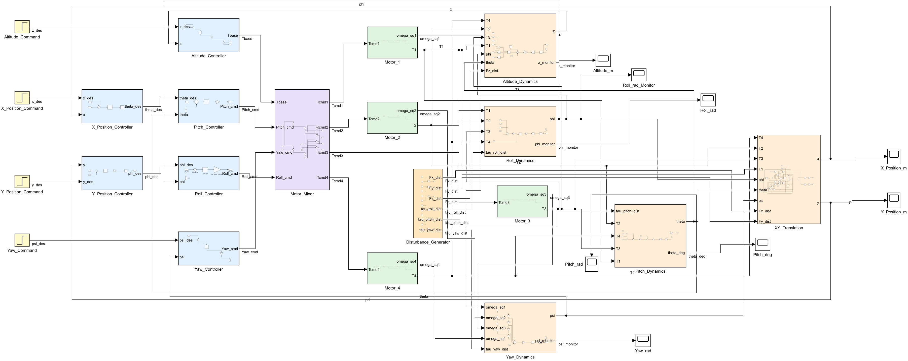
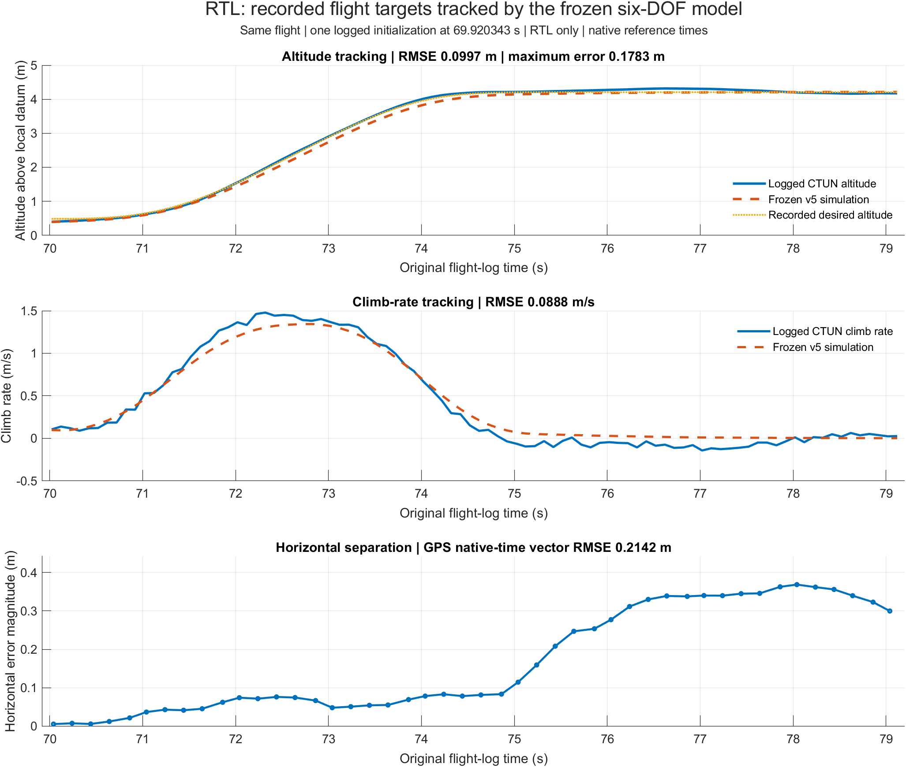

# UAV Air-Quality Sensing and Quadrotor Simulation

This repository documents a Tarot 650-based UAV being prepared for particle-sensing research and a separate MATLAB/Simulink quadrotor model used to explore flight dynamics and control.

The project treats the aircraft, sensor mounting, data logging and analysis as parts of one measurement workflow. The intended research direction is repeatable, position-referenced particle sensing around built infrastructure, with particular attention to possible sampling interference from the aircraft.

## Project status

| Area | Current status |
|---|---|
| Baseline aircraft | Assembly, wiring, motor-direction checks, GPS/compass calibration, radio calibration and reported pre-arm configuration are complete in the source project records. |
| Sensor mount and inlet | In design; fabrication, installation and final measurement are pending. |
| Flight evidence | 61,814 DataFlash records across 74 message types processed locally. A location-free derived RTL subset is included; the raw log remains private. |
| Physical flight testing | First flight recorded on 28 September 2026; native-rate log processing and a public analysis summary are available. Final-payload testing and repeatability remain pending. |
| Air-quality measurements | Not started. No sensor dataset or spatial map exists yet. |
| Simulink model | The packaged nominal six-degree-of-freedom model includes cascaded control, motor models, disturbances, deterministic sensor noise, three flight modes and 3-D visualisation. |
| Flight-log comparison | Separate frozen v5 RTL target tracking: 0.09967 m altitude / 0.21418 m horizontal RMSE over 9.284754 s, initialized once from logged state. Whole-flight and independent-flight prediction remain unresolved. |

The original educational model and the latest conditional RTL comparison are both packaged. Aircraft physics have not been comprehensively identified. The real aircraft runs ArduCopter; the Simulink controller has not been deployed to the Pixhawk. The final sensor mount and air-quality measurements remain pending.



*Packaged nominal Simulink model overview.*

See [project status](docs/project-status.md), [limitations](docs/limitations.md) and the [roadmap](docs/roadmap.md) before interpreting any result.

## Latest result



[Current case study and 3-D animation](portfolio/case-study.md) · [First-flight analysis](flight-testing/first-flight-analysis.md) · [Portable RTL rerun](simulation/docs/RTL_PORTFOLIO_SCOPE.md)

## Repository structure

```text
hardware/        Aircraft integration, BOM and wiring documentation
research/        Motivation, literature synthesis and experimental methodology
simulation/      MATLAB/Simulink model, scripts, tests and selected evidence
flight-testing/  Configuration and test-record templates; future reviewed results
portfolio/       Concise case-study material derived from supported evidence
docs/            Status, roadmap, evidence policy and reproducibility guidance
```

The Simulink package is available under [simulation](simulation/README.md). The current public hardware and research record is available under [hardware](hardware/README.md) and [research](research/README.md); the [portfolio case study](portfolio/case-study.md) is an evidence-limited summary. Private correspondence, literature PDFs, archives, raw logs, generated caches and GPS-tagged photographs are deliberately absent.

## Current public packages

- [Hardware integration record](hardware/README.md), including the [recorded BOM](hardware/bom.md), [wiring/integration record](hardware/wiring-and-integration.md) and [design rationale](hardware/design-rationale.md).
- [Research motivation and methodology](research/motivation.md) for the planned particle-sensing workflow.
- [Portfolio case study](portfolio/case-study.md), which separates physical integration, simulation evidence and future experimental claims.
- [Flight-testing templates](flight-testing/README.md), with the first-flight analysis summary and blank preparation/evidence templates for subsequent testing.

## Evidence language

- **Completed** means an artefact or project record supports the work described.
- **Reported** means the builder recorded that an activity occurred, but the public repository does not yet contain independently reviewable evidence.
- **Simulated** identifies results produced by the nominal Simulink model.
- **Planned** and **pending** describe work that has not been completed.

The RTL comparison uses one inspected flight, recorded targets, one logged initial state and simulated feedback. Its score is 7.363/10, below the original 8/10 target; the manual-descent failure remains documented. It does not establish whole-flight prediction or sensing accuracy.

## Reproducing the project

The model, scripts and run sequence are documented in the [simulation README](simulation/README.md). Environment assumptions and the distinction between saved and rerun evidence are recorded in [reproducibility](docs/reproducibility.md).

## Contributing

Changes should be made on focused feature branches and supported by reproducible evidence. Read [CONTRIBUTING.md](CONTRIBUTING.md) before proposing changes.

## Licence

No public licence has been selected yet. Until a licence is added, the contents remain subject to the default protections of copyright law. Third-party papers, manuals and private correspondence are not part of this repository.

