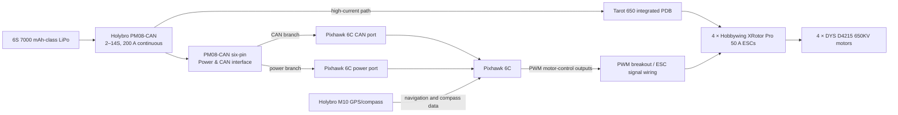

# Wiring and integration record

This document is a high-level public record of the current aircraft integration. It is not a flight procedure and does not replace the manufacturer manuals, an exported parameter set or a final pre-flight inspection.

## Current architecture

The current builder-provided architecture is represented below. The diagram separates the high-current propulsion path from the flight-controller power, CAN and PWM signal paths.



Plain-text fallback:

```text
6S LiPo battery
       │
       ▼
Holybro PM08-CAN ───────────────► Tarot integrated PDB ─► 4 ESCs ─► 4 motors
       │
       └─ six-pin Power & CAN harness
             ├─ CAN branch  ─────────► Pixhawk 6C CAN port
             └─ power branch ─────────► Pixhawk 6C power port

GPS/compass ─────────────────────► Pixhawk 6C
Pixhawk PWM outputs ─► PWM breakout ─► ESC signal inputs
```

The six-pin PM08-CAN interface is shown as a harness that branches into the two Pixhawk interfaces confirmed in the current as-built description: one CAN connection and one power connection. This record intentionally does not claim the exact pin-to-pin mapping, cable orientation or port numbers. Record those details from the installed harness and exported configuration before treating this as a definitive wiring sheet.

The [Holybro PM08-CAN documentation](https://docs.holybro.com/power-module-and-pdb/power-module-comparison) identifies the unit as a 2–14S, 200 A continuous power module with a combined Power & CAN connector. Holybro's [DroneCAN setup guidance](https://docs.holybro.com/power-module-and-pdb/power-module/dronecan-power-module-setup) describes connecting the CAN side to a flight-controller CAN port; the installed Pixhawk port should still be recorded rather than inferred.

## Current power path

The recorded high-current architecture is:

```text
6S battery → PM08-CAN → Tarot centre-plate PDB
           → four ESCs → four motors
```

The Tarot centre plate is treated as a power-distribution board. The PM08-CAN is both the battery power-monitor interface and the source of the documented Pixhawk power/CAN harness in the current build description. The PM08-CAN path is not the same thing as a direct analogue sensor connection to a Pixhawk POWER port.

The battery is currently recorded as a 6S 7000 mAh-class LiPo configuration. Confirm the exact battery label, connector and installed capacity in the aircraft configuration record before flight.

## Flight-controller interfaces

The recorded signal and data directions are:

- the GPS/compass sends navigation and compass data into the Pixhawk;
- the PM08-CAN sends power-monitor telemetry to the Pixhawk over CAN and provides the confirmed power branch;
- the Pixhawk sends four motor-control PWM outputs through the breakout to the ESC signal inputs; and
- the ExpressLRS receiver provides manual/control input to the Pixhawk.

The project record reports GPS/compass calibration, radio calibration and pre-arm configuration checks as complete. Exact port-level and parameter-level evidence is not included in this documentation-only release. Do not infer a connector or parameter from a similar-looking cable; use the eventual as-built export for a definitive wiring record.

## Recorded Quad X motor mapping

The current recorded mapping is:

| ArduPilot output | Physical position | Tarot plate label | Recorded rotation viewed from above |
|---:|---|---|---|
| 1 | Front-right | M1 | CCW |
| 2 | Rear-left | M3 | CCW |
| 3 | Front-left | M2 | CW |
| 4 | Rear-right | M4 | CW |

Motor assignment and direction are reported as checked with the propellers removed. This mapping is an integration record, not evidence of a successful airborne test.

## Evidence boundary

The following are not yet public or not yet established:

- exact PM08-CAN-to-Pixhawk port numbers, cable pinout and exported parameters;
- final payload mount, inlet geometry, mass and centre of gravity;
- installed 12×4.5 propeller current and thermal behaviour;
- vibration, failsafe, hover and endurance behaviour;
- a completed flight test; and
- synchronized sensor data.

The public repository therefore documents the recorded configuration and unresolved evidence rather than presenting a completed airworthiness or measurement-validation claim.
