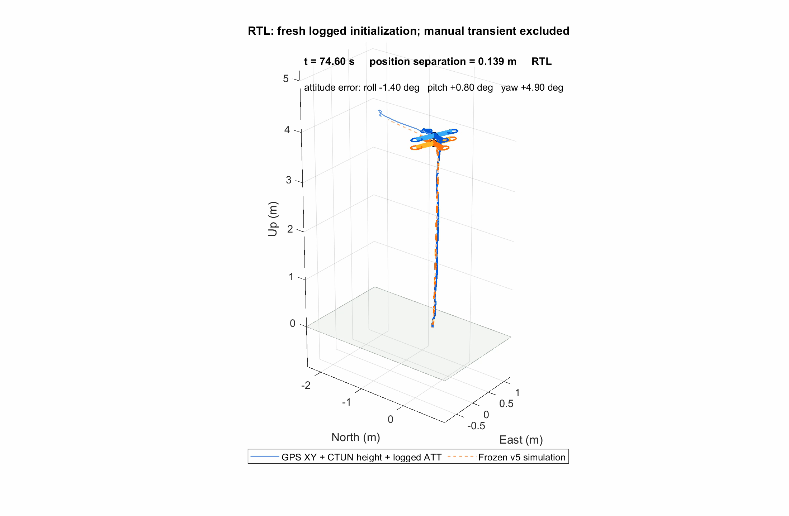

# Quadrotor Flight Modelling and RTL Comparison

Portfolio copy prepared 4 October 2026. Project work documented June–October
2026; one recorded flight on 28 September. This replaces the September
pre-flight draft. See the [project status](../docs/project-status.md) and media below for the current evidence.

## Overview

I assembled and configured a Tarot 650-based quadrotor and developed a modular
six-degree-of-freedom flight model in MATLAB/Simulink. I then extended the
project with AI-assisted flight-log processing, replay, diagnostics and visual
comparison tools to investigate how the simulated response matched a real
ArduPilot flight.

The current demonstration tracks recorded Return to Launch (RTL) targets
with simulated feedback. Over a 9.3-second interval, initialized once from
logged state, the frozen model achieved **0.10 m altitude RMSE** and
**0.21 m horizontal RMSE** against the logged references. Tests outside that
scope exposed an unresolved manual-descent event, which remains part of the
engineering record.

**Tools:** MATLAB, Simulink, Python, ArduCopter, Git/versioned experiment snapshots.

## The aircraft and original aim

The aircraft integrates a commercial Tarot 650 Sport frame, four DYS D4215
650KV motors, Hobbywing XRotor Pro 50 A ESCs, 12×4.5 propellers, a 6S battery,
Pixhawk 6C, Holybro M10 GPS/compass and an ExpressLRS receiver. Wiring, motor
direction, radio/GPS/compass configuration and the DroneCAN power monitor were
documented. The later reported flight mass is approximately 3 kg.

The intended application is particle-size/air-quality sensing around built
infrastructure. I reviewed payload, sampling and sensor-placement constraints
and prepared a BOM, wiring guide, literature audit and staged research plan.
Sensor-mount completion and environmental measurements remain future work.
The real aircraft is controlled by ArduCopter.

## From simulation to flight evidence

The original model contains position/altitude/attitude control, a four-motor
mixer, actuator dynamics and limits, six-degree-of-freedom dynamics, flight modes,
yaw-aware command mapping, disturbances, sensor noise and 3-D outputs. Internal
tests checked the configured software behaviour before comparison with flight data.

The first-flight processing pipeline imported **61,814 records across 74 message
types**. It retained native timestamps and distinguished GPS position, CTUN
altitude/climb and other estimator signals. The approximately 105-second log
duration includes periods outside the airborne comparison.

Initial command replay exposed metre-scale horizontal drift. The investigation
corrected a NED/FRD-to-positive-Up attitude interface, tested initialization,
mass, reference alignment and force hypotheses, and restored simulated
horizontal feedback in a separate experiment. Position-target tracking improved,
while frozen manual-flight and continuous-replay tests showed that a close RTL
fit did not transfer to every flight phase.

## The RTL result

The featured frozen v5 experiment starts at **69.920343 s** and ends at
**79.205097 s** in the same recorded flight. It takes one logged initial state,
then uses recorded internal targets and its own simulated feedback. It does
not continually replace its states with the future measured trajectory.

| Metric | Result |
|---|---:|
| Altitude RMSE, CTUN reference | 0.09967 m |
| Horizontal vector RMSE, GPS reference | 0.21418 m |
| Climb-rate RMSE, CTUN reference | 0.08882 m/s |
| Maximum altitude error | 0.17831 m |
| Roll / pitch RMSE | 1.2416° / 1.3185° |
| Project-specific overall score | 7.363/10; below the original 8/10 target |

Scores use **92 native CTUN samples** and **46 native GPS samples**, with simulation
interpolated to those reference timestamps. The saved RTL-only rerun reproduced
the prior frozen trajectory within 4.36e−7 in the six state channels.

*Frozen six-DOF RTL tracking against one flight's logged references. The result
is conditional on recorded targets, logged initialization and prior gain selection.*

*Blue: GPS North/East, CTUN height and logged attitude. Orange: frozen v5
simulation. Positions are local coordinates, and the log timestamp is retained.*

View the [3-D RTL video](assets/rtl-3d-demo.mp4)
or use the [animated GIF](assets/rtl-3d-demo.gif).
The full video uses half-speed playback and common reference coverage from
70.040173 to 79.205097 s, following initialization at 69.920343 s.

## What the failed tests taught me

A brief manual-descent event around 68.44 s produced a logged upward velocity
change of approximately 0.99 m/s in 0.10 s, which the model did not reproduce.
Two IMUs supported the event, but shared mounting and estimator dependencies
prevented unique attribution. Subsequent error persisted, so excluding the
event's scored rows did not repair the continuous trajectory.

Six checks considered command logging, thrust mapping, descent airflow,
mounting/attitude, timing/filtering and the manual/autonomous controller
boundary. None established a transferable fix. I therefore kept RTL as the
active demonstration and retained Stabilize/Loiter comparisons as unresolved
transfer evidence. This sharpened the distinction between useful closed-loop
tracking and a model that predicts the whole aircraft response.

## My contribution and tool assistance

My work includes hardware choices and assembly, the original controller,
mixer, motor and plant work, flight observations and experiment decisions.
Later import, replay, fitting, diagnostics, tests, reports and visualizations
were substantially AI-assisted. I present those additions as assisted
engineering work and keep the claim boundary tied to evidence I can trace.

## Limits and next steps

The current comparison uses one previously inspected flight and logged
estimator references. Propulsion capacity, damping, axis alignment and other
physical parameters remain provisional. The Simulink controller has not been
deployed to the aircraft, and independent-flight prediction remains unverified.

The next engineering steps are to improve propulsion/transient evidence,
justify mode-transition state handling, freeze the parameters and evaluate a
new flight. The environmental branch then requires a completed mount,
timestamped payload data and repeatable sampling experiments before claiming
air-quality mapping results.

## Compact portfolio card

**Quadrotor Flight Modelling and RTL Comparison**

Built and configured a quadrotor, developed a six-DOF Simulink model, and
compared it with a real ArduPilot flight using native-time metrics and 3-D
animation. Frozen RTL target tracking achieved 0.10 m altitude and 0.21 m
horizontal RMSE over a 9.3 s interval initialized from logged state;
manual-flight transfer limitations remain documented. Later analysis tooling
was AI-assisted.
