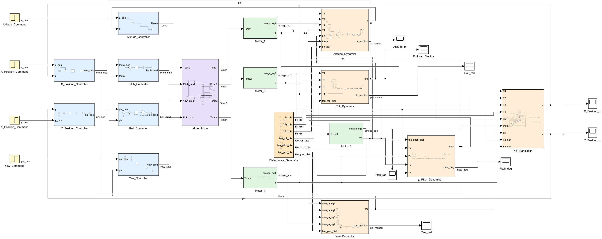
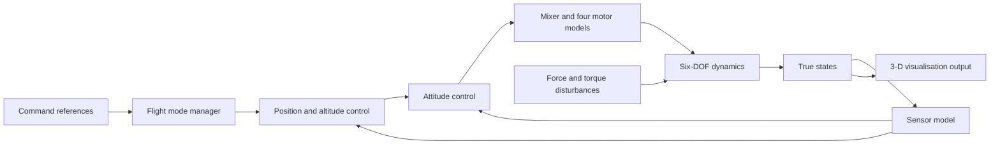
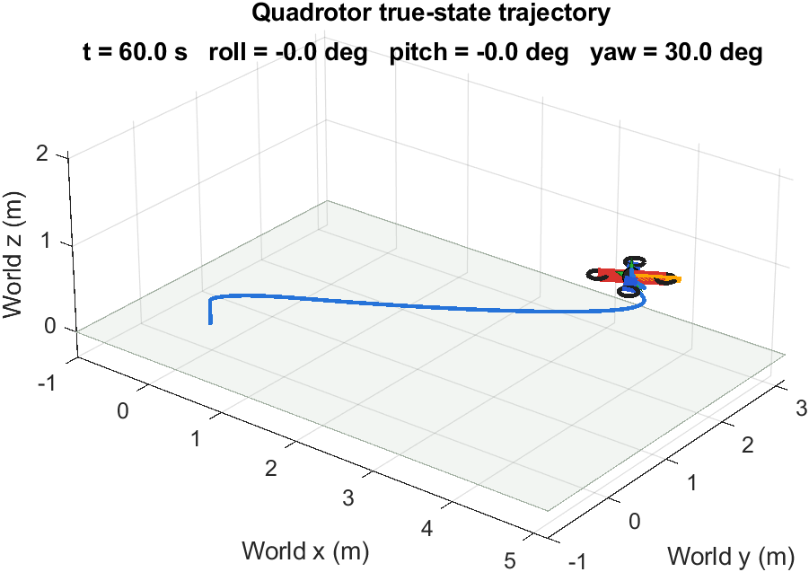

# Quadrotor Simulink model

This package contains a nominal six-degree-of-freedom quadrotor model for learning, controller development and repeatable simulation experiments. It is related to the physical air-quality UAV through the broader project motivation, but its parameters have not been calibrated against that aircraft and its controller is not deployed to the Pixhawk.



## Included scope

- translation in x, y and z and rotation in roll, pitch and yaw;
- cascaded horizontal-position, altitude and attitude control;
- four-motor mixing and four first-order motor/propeller models;
- switchable external force and torque disturbances;
- six-channel deterministic, band-limited sensor noise;
- Stabilize/manual-attitude, Position Hold and Auto command modes;
- yaw-aware conversion from world-frame position commands to body roll/pitch commands;
- a one-way true-state output for 3-D animation.

The model uses SI units and radians internally. Its mass, inertia, thrust, motor and controller values are nominal educational values retained for reproducibility.

## Architecture



The visualisation path does not feed the controller or plant. Further subsystem views are available in [images](images/).

## Requirements

The saved development record identifies:

- MATLAB R2024b;
- Simulink R2024b;
- Windows.

The model may work in other releases, but that has not been checked. Simulink Test is not required by the included assertion-based scripts. The animation uses MATLAB graphics and does not require Simulink 3D Animation or UAV Toolbox according to the saved project record.

## Open and run the model

Start MATLAB in the repository root, then run:

```matlab
modelFile = fullfile(pwd,"simulation","model","Drone_simulation.slx");
open_system(modelFile)
```

The model workspace loads values from [`model/Drone_parameters.m`](model/Drone_parameters.m). Edit that file to change the configured scenario. If the model is already open after an edit, reload it with:

```matlab
run(fullfile(pwd,"simulation","scripts","reload_drone_parameters.m"))
```

Parameter definitions and flight-mode settings are described in the [parameter guide](docs/PARAMETER_GUIDE.md) and [guidance, sensor and flight-mode guide](docs/GUIDANCE_SENSOR_FLIGHT_MODES_GUIDE.md).

## Validation

Run the integrated behavioural checks from the repository root:

```matlab
run(fullfile(pwd,"simulation","tests","validate_guidance_features.m"))
```

The script loads the canonical model, applies scenario variables through `Simulink.SimulationInput`, checks structural assumptions and evaluates explicit numerical assertions. It writes generated results below `simulation/outputs/validation/`; these binary files are intentionally ignored by Git.

The existing [system validation report](docs/SYSTEM_VALIDATION_REPORT.md) records the acceptance criteria, configured results and limitations from the source workspace. Both packaged validation workflows were rerun successfully in MATLAB/Simulink R2024b on 7 September 2026; see the [package validation record](docs/PACKAGE_VALIDATION.md). These checks establish behaviour only for their defined simulations; they do not demonstrate physical-flight performance, full-envelope robustness or calibration to the Tarot aircraft.

Additional focused documentation:

- [disturbance model](docs/DISTURBANCE_GUIDE.md);
- [y-translation physics review](docs/Y_TRANSLATION_PHYSICS_REVIEW.md);
- [3-D visualisation](docs/3D_VISUALIZATION_GUIDE.md);
- [package validation record](docs/PACKAGE_VALIDATION.md).

## 3-D demonstration

Generate the demonstration output, then validate its coordinate convention:

```matlab
run(fullfile(pwd,"simulation","scripts","run_3d_visualization.m"))
run(fullfile(pwd,"simulation","tests","validate_3d_visualization.m"))
```

The second command expects `visualization_last_run.mat` from the first command. Video recording is disabled by default and can be enabled in the parameter file.



## Package map

- [`model/Drone_simulation.slx`](model/Drone_simulation.slx) — canonical Simulink model.
- [`model/Drone_parameters.m`](model/Drone_parameters.m) — single model-workspace parameter source.
- [`scripts/`](scripts/) — parameter reload and 3-D demonstration utilities.
- [`tests/`](tests/) — deterministic assertion-based validation scripts.
- [`docs/`](docs/) — model behaviour, parameters and validation interpretation.
- [`images/`](images/) — selected current model and visualisation screenshots.

Development snapshots, caches, autosaves, generated `.mat` outputs and archived layout images are deliberately excluded.
